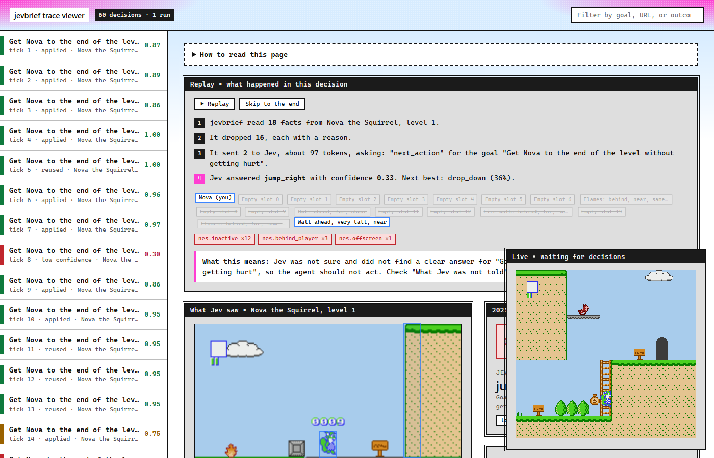

# nes adapter

Chooses the next move in an NES platformer from the game's memory. It ships one game mapping: level 1-1 of [Nova the Squirrel](https://github.com/NovaSquirrel/NovaTheSquirrel), an open-source platformer by NovaSquirrel.

```bash
pip install "jevbrief[nes]"          # adds the cynes emulator (MIT), which needs only numpy
python examples/nes_live.py --rom path/to/nova.nes --headed
```

`--headed` opens the live viewer, where the game and each decision appear as they happen. Without it, the script prints the viewer's address.

## The game file

jevbrief never ships, downloads, or links to a ROM for you. Nova the Squirrel is free: download `nova.nes` yourself from the author's [v1.0.6a release](https://github.com/NovaSquirrel/NovaTheSquirrel/releases/tag/v1.0.6a). Its code is GPL-3.0-or-later and its graphics and levels are CC BY-NC-SA 4.0, so it may not be sold. jevbrief warns if your file is not that release, because the memory map may not match.

Commercial games such as Super Mario Bros are not supported. Their ROMs are copyrighted, and downloading them is infringement in most countries.

## Live viewer

Your browser opens the live viewer at `http://127.0.0.1:8765/`:

- **Bottom right:** the game, as it plays.
- **Left:** one row per decision, colored by Jev's confidence.
- **Middle:** what Jev was told, what was dropped and why, the frame with boxes, and how sure Jev was of each move.

The terminal prints one line per decision, such as `jump_right 0.89 -> jump_right x=7.3 health=4`. Replay a run later with `jevbrief view traces/nes.jsonl`.



## Options

| Option | Default | What it does |
|---|---|---|
| `--decisions` | 150 | How many moves to play |
| `--headed` | off | Open the viewer in your browser |
| `--timeout` | 3 | Seconds before a slow Jev call is retried |
| `--danger` | 0.7 | Wait instead of walking right when Jev's danger answer is at least this |
| `--port` | 8765 | Port of the live viewer |
| `--trace` | `traces/nes.jsonl` | Where the trace is written |

## Troubleshooting

- **A few slow decisions at the start:** the first Jev calls after a quiet period can take several seconds. The game waits, so play is not affected, and calls speed up to a few hundred milliseconds.
- **jevbrief warns the ROM is not the release:** use `nova.nes` from v1.0.6a; other builds may use a different memory layout.
- **Port in use:** pass `--port 8770`.
- **Nova gets stuck:** she often stops at a tall wall around block 56, where the path continues below a thin ledge. Jev is not a game-playing model; the trace shows exactly what it was told at that point.

## Python

```python
from jevbrief import Briefing
from jevbrief.adapters.nes import NesAdapter
from jevbrief.adapters.nes.game import NovaGame, choose

game = NovaGame("nova.nes")
game.start_level()                        # title screen, level select, then level 1-1
brief = Briefing(NesAdapter(), "Get Nova to the end of the level", trace="traces/nes.jsonl")
for _ in range(100):
    brief.extract(game.snapshot())
    decision = brief.decide()             # the emulator is paused while Jev answers
    game.hold(choose(decision, 0.7))      # hold the action, then keep its direction until Nova lands
```

`extract()` takes a snapshot, not an emulator: `{"ram": 2048 bytes, "map": the 4096 bytes at $6000, "flags": the 256 bytes at $7000, "frame": optional 240x256 RGB}`. Any emulator that can read memory works.

## What Jev sees

Jev never sees raw numbers, hex, or pixels. The adapter reads memory once per decision and describes what matters in words:

| Fact | Example |
|---|---|
| `player` | `state: on the ground`, `standing_on: a thin ledge she can drop through`, `health: hurt`, `last_action: drop_down, nothing changed` |
| `enemy`, `platform`, `item` (16 object slots) | `Owl: ahead, near, above` |
| `wall` | `Wall ahead, low (one block), touching`: low, tall (2 to 3 blocks), or very tall |
| `pit` | `Pit ahead, wide, close`: narrow (1 to 2 blocks) or wide |
| `hazard` | `Spikes ahead, near`, `Lava ahead, close` |

Distance is `touching` (under 1 block), `close` (under 3), `near` (under 7), or `far`. Height is `same height`, `above`, or `below` the player's feet. Walls, pits, and hazards come from the level map and the game's block flags (solid, solid on top, behavior), read from the running game.

`last_action` tells Jev when its last move had no effect. It also changes the state, so a move that failed is not reused with no new call.

## Rules

| Rule | Effect |
|---|---|
| `nes.inactive` | Drops empty object slots |
| `nes.effect` | Drops visual effects and the player's own shots |
| `nes.offscreen` | Drops objects outside the screen |
| `nes.behind_player` | Drops things already passed (a block or more behind) |
| `nes.far_ahead` | Drops things 7 or more blocks ahead |
| `nes.threat` | +0.3 for an enemy close ahead at the player's height |
| `nes.in_path` | +0.2 for a wall, pit, or hazard touching or close |
| `nes.player` | Keeps the player |
| Core | `duplicate`, `low_score`, `budget` |

## Question pack

`platformer` asks two independent questions in one call:

- `next_action`: a Choice over `run_right`, `jump_right`, `short_hop`, `wait`, `run_left`, and `drop_down`. Each option says what it clears ("a small hop: clears a low wall one block high, or a narrow pit").
- `danger`: a Noul, "If Nova keeps walking right for the next half second, will she touch an enemy, spikes, or lava, or fall into a pit?"

The example's `choose()` plays Jev's top action even at low confidence, because a wrong move in a game is cheap. It waits instead when the call fails, or when Jev picks `run_right` while `danger` is 0.7 or more. Each action is held for 6 to 24 frames, then its direction is held until Nova lands.

## Viewer

The `spatial` renderer shows the frame for each decision with boxes on the player, objects, walls, pits, and hazards. Frames are PNG, written with the standard library.

`jevbrief view --live traces/nes.jsonl` serves the viewer on `127.0.0.1` and adds each decision as it is written, with the latest game frame in a corner panel. The example starts it for you.

## Benchmark

[bench/nes/results.md](../../bench/nes/results.md): raw memory (every object slot and level column with raw numbers) against jevbrief's facts, over the same number of decisions from the same save state. `python bench/nes/verify_ram.py --rom nova.nes` checks the memory map against your copy of the game.

## Add another game

Follow [skills/jevbrief-nes-game/SKILL.md](../../skills/jevbrief-nes-game/SKILL.md), by hand or with a coding agent such as Claude Code: check the ROM is legal, find and verify the memory map (`ram_search.py` finds addresses by watching which bytes change), turn memory into facts in words, then add actions, rules, tests, a benchmark, and docs.
