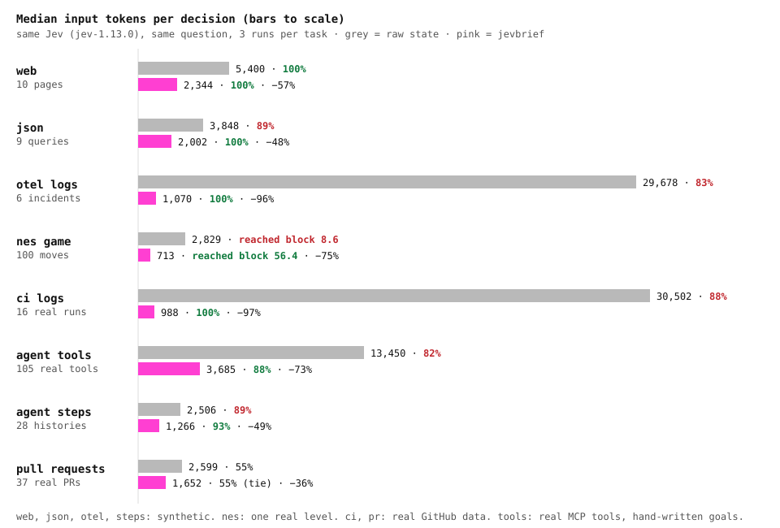

# How it works

Every adapter uses the same pipeline. Only the first step, reading the source, is specific to an adapter.

## The pipeline

| Step | What happens |
|---|---|
| **1. Extract** | The adapter reads the source into facts. Each fact has a `kind`, a `label`, `attrs` sent to Jev, and `meta` kept private. Numbers, counts, and dates become words here, because Jev is weak at raw numbers. |
| **2. Rules** | A `RuleSet` scores each fact and drops noise. Core rules are shared, adapters add their own, and you can remove, add, or reorder rules without forking. |
| **3. Budget** | Kept facts are sorted by score and cut to a token budget (default 2,000) and an option cap (default 60). |
| **4. Fingerprint** | If the kept facts have not changed, the previous answer is reused and Jev is not called. |
| **5. Ask Jev** | A question pack builds one or more questions (Choice, Noul, or Score) in a single call. Options are either the facts or a fixed set of actions. |
| **6. Trace** | One JSON line per decision, with a legend of every reason code used. Images are stored next to the trace. |

## Reason codes

Every dropped fact gets a reason code with a description, so a wrong answer can be debugged. Core codes are shared by every adapter. Adapter codes are namespaced as `<adapter>.<code>`, such as `ci.after_failure` or `tools.not_relevant`, and each adapter's page lists its own.

| Code | Meaning |
|---|---|
| `hidden` | Not observable right now |
| `disabled` | Exists but cannot be acted on |
| `unlabeled` | No usable label, so Jev could not tell what it is |
| `duplicate` | Same kind and label as a higher-scored fact |
| `low_score` | Scored below the keep threshold |
| `budget` | Would have been kept, cut only to fit the token or option budget |

Force-keep facts with `pins=["<fact id>"]`. Fact IDs are stable across decisions.

## Outcomes

Every decision comes back in the same shape:

| `decision.outcome` | Meaning | Your code should |
|---|---|---|
| `applied` | Jev answered at or above `min_confidence` (default 0.5) | Act on `decision.choice`, and on `decision.fact` when the options are facts |
| `reused` | The facts did not change, so the last answer was reused with no API call | Act, but stop if nothing changes |
| `low_confidence` | Below `min_confidence`, or Jev chose "none" | Take no action |
| `error` | The API call failed | Take no action |

## The viewer

`jevbrief ask ... --view` opens the viewer after a run, and `jevbrief view` opens the newest trace. Each decision starts with an animated replay:
1. every fact read
2. the dropped ones, struck out with their reason
3. the ones sent to Jev
4. Jev's answer, with a plain-English summary of what it means

Each adapter picks the view that fits its source:

| View | Used by | Shows |
|---|---|---|
| Table | json, ci, tools, steps | Every fact with its score and reason |
| Timeline | otel | One bar per log group, with the incident start marked |
| Snapshot | web | The page with Jev's pick outlined |
| Live | nes | Decisions as they are written, next to the running game (`jevbrief view --live`) |

The viewer is a single HTML file with the trace and images embedded. It needs no server and no network, so you can attach it to a bug report.

## Benchmarks

Each adapter is measured the same way:
- **Raw arm:** sends what a naive integration would send: every element, every record, every tool, or the most recent log lines.
- **jevbrief arm:** sends the kept facts.
- **Setup:** both arms use the same Jev (`jev-1.13.0`) and the same question, with three runs per task. Tokens are median input tokens.

| Adapter | Data | Tasks | Raw accuracy | jevbrief accuracy | Raw tokens | jevbrief tokens |
|---|---|---|---|---|---|---|
| [tools](../bench/mcp/results.md) | Real MCP tools, hand-written goals | 40 goals over 105 tools | 82% | **88%**, 94% hybrid | 13,450 | **3,685** (−73%) |
| [steps](../bench/steps/results.md) | Synthetic | 28 agent histories | 89% | **93%** | 2,506 | **1,266** (−49%) |
| [ci](../bench/ci/results.md) | Real | 16 failed GitHub Actions runs | 88% | **100%** | 30,502 | **988** (−97%) |
| [otel](../bench/otel/results.md) | Synthetic | 6 incidents | 83% | **100%** | 29,678 | **1,070** (−96%) |
| [json](../bench/json/results.md) | Synthetic | 9 queries | 89% | **100%** | 3,848 | **2,002** (−48%) |
| [web](../bench/results.md) | Synthetic | 10 pages | 100% | 100% | 5,400 | **2,344** (−57%) |
| [nes](../bench/nes/results.md) | Real game | 100 moves on level 1-1 | block 8.6 | **block 56.4** | 2,829 | **713** (−75%) |

- **ci's flaky question:** jevbrief scored lower, 67% against 93%. The raw arm answered "flaky" every time, and 13 of the 16 labels are flaky.
- **tools' ranking:** keyword ranking dropped the right tool for 3 of 36 goals, all synonyms. Hybrid ranking keeps it for 35 of 36 and reaches 94% accuracy.
- **Synthetic sets:** some rules were designed while building them, so treat those numbers as illustrations.

Reproduce any of them with `jevbrief bench`.

## Privacy

- **API key:** read from the environment or `.env`, and never printed, logged, or written to a trace.
- **Adapters send only what they list:**
  - The web adapter never sends form values.
  - The json adapter sends only the configured fields and buckets.
  - The otel and ci adapters send message templates, with IDs, emails, and addresses replaced.
  - The tools adapter sends each tool's name, a short description, and its required parameter names.
- **Traces:** they contain labels, source names, and, for web pages, a screenshot. Treat them like logs, and use `--no-screenshot` for private pages.
